## Index

- [Introduction](#introduction)
- [Diagram](#diagram)
- [Requirements](#requirements)
- [Ansible](#ansible)
  - [Playbook Command](#playbook-command)
- [AWS](#aws)
  - [Network](#network)
  - [ECS Cluster](#ecs-cluster)
  - [AWS EFS](#aws-efs)
  - [ECS Tasks](#ecs-tasks)
  - [Domain](#domain)
- [Application](#application)
  - [Web Console](#web-console)
  - [ECS Auto Scaling](#ecs-auto-scaling)
- [Destroy](#destroy)
  - [Via Ansible](#via-ansible)
  - [Via CloudFormation](#via-cloudformation)

## Introduction

_This pipeline via automation will deploy Prometheus and Grafana on an AWS Fargate also the core infrastructure to support it._

<a href="https://grafana.com">Grafana</a> - Grafana is a multi-platform open source analytics and interactive visualization web application.

<a href="https://prometheus.io/docs/introduction/overview/">Prometheus</a> - Prometheus is a free software application used for event monitoring and alerting.

## Diagram

The below diagram shows the AWS resources.

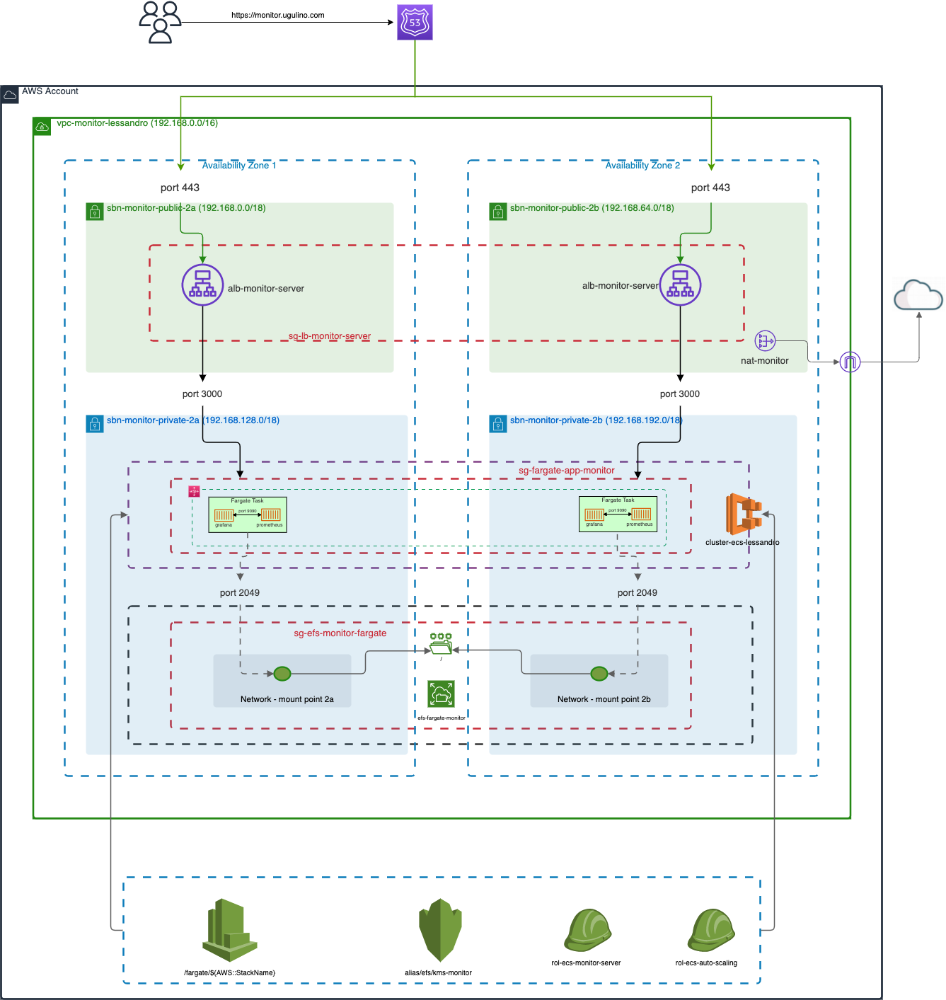

## Requirements

1. These tools were installed:

- <a href="https://docs.aws.amazon.com/cli/latest/userguide/cli-chap-install.html">AWS Cli</a>
- <a href="https://docs.ansible.com/ansible/latest/installation_guide/intro_installation.html#installing-ansible-on-macos">Ansible</a>

2. Update the file `group_vars/all/common.yml` accordingly.

```yaml
---
cloudformation:
  check_mode_override: false
  region: ap-southeast-2
  create_changeset: true
  state: present

Route53:
  HostedZoneName: "ugulino.com."
  RecordName: "monitor.ugulino.com"
  CertificateId: "5eaa197e" # your ACM Id
```

## Ansible

### Playbook Command

The file `deploy-role.yml` will deploy each role required to deploy this project.

```yaml
---
- hosts: localhost
  roles:
    - vpc-baseline
    - ecs-cluster
    - ecs-monitor
    - route53
```

The below command will execute the tasks defined on the above file.

```
ansible-playbook deploy-role.yml -vvv
```

**Output**

You can verify the deployment via ansible output or via AWS CloudFormation console.

- Ansible Output:

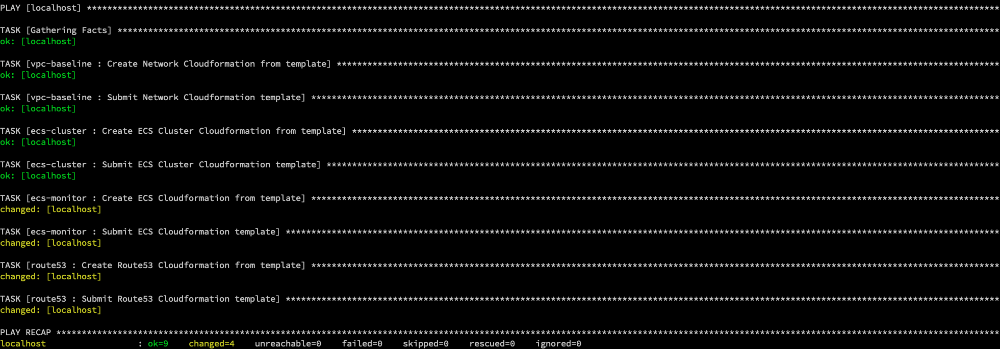

- AWS CloudFormation Console:

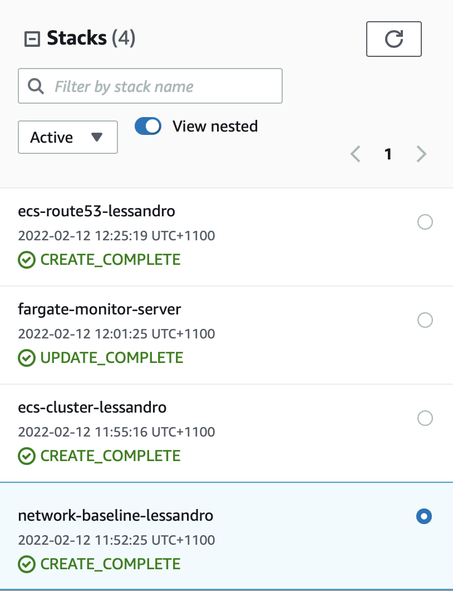

## AWS

### Network

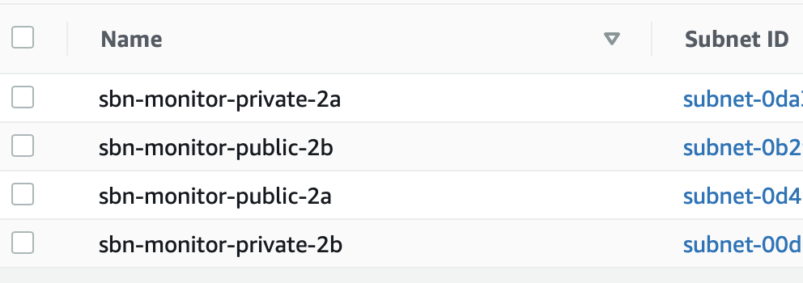

### ECS Cluster

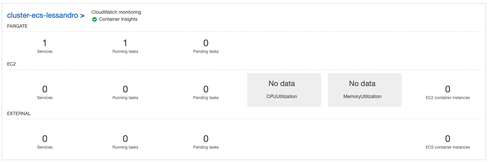

### AWS EFS

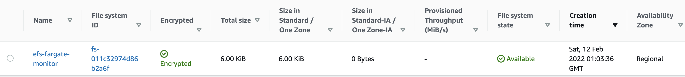

### ECS Tasks

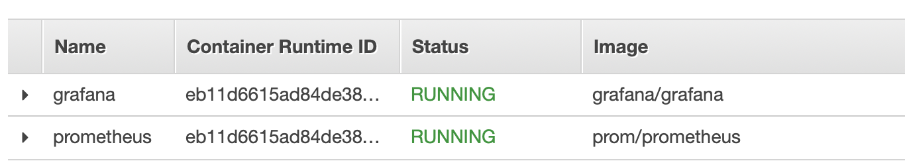

### Domain

An 'A' record was created pointing to Application Load Balancer via automation.

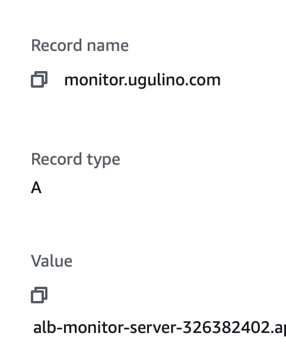

## Application

### Web Console

You can access and setup Grafana accessing the URL https://monitor.ugulino.com (be aware that this is my domain, probably you've setup a different one)

Default username and password is `admin`

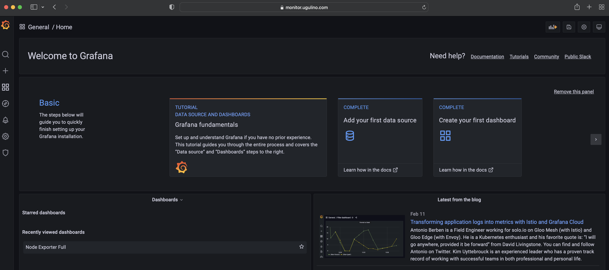

Setup the Data Source for prometheus.

**EC2 REQUIREMENTS**:

- The EC2 instances taged as below
- The application <a href="https://prometheus.io/docs/guides/node-exporter/">node-exporter </a> installed on the EC2.
- Allow Inbound and Outbound port 9100.

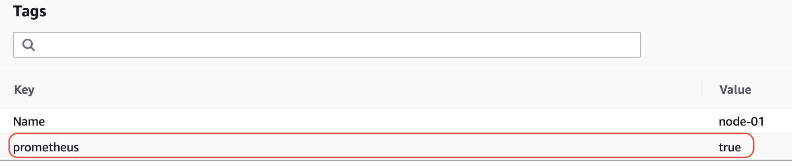

**Grafana Dashboard Id 1860**

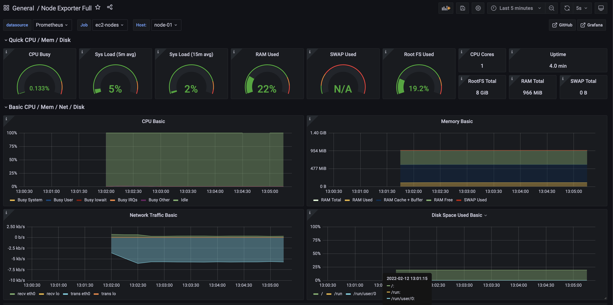

The below `prometheus.yml` was used for this environment. Upload this file to AWS EFS.

```yaml
################-----//-----################

# USE THIS FILE AS AN EXAMPLE.

################-----//-----################

# my global config
global:
  scrape_interval: 15s # Set the scrape interval to every 15 seconds. Default is every 1 minute.
  evaluation_interval: 15s # Evaluate rules every 15 seconds. The default is every 1 minute.

scrape_configs:
  - job_name: "ec2-nodes"
    ec2_sd_configs:
      - region: ap-southeast-2
        port: 9100

    relabel_configs:
      - source_labels: [__meta_ec2_tag_prometheus]
        regex: true.*
        action: keep

      - source_labels: [__meta_ec2_tag_Name]
        target_label: instance
```

## Destroy

Basically, to destroy this deployment you can either do it via ansible command or AWS CloudFormation.

### Via Ansible

Change the file `group_vars/all/common.yml`

```yaml
cloudformation:
  check_mode_override: false
  region: ap-southeast-2
  create_changeset: true
  state: absent # this is the value you need to change to destroy the stacks
```

Execute the command:

```
ansible-playbook deploy-role.yml -vvv
```

### Via CloudFormation

Select the CloudFormation stack, click delete, and then _Delete stack_.

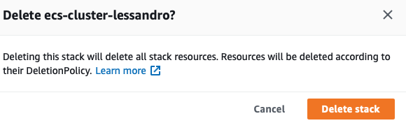
